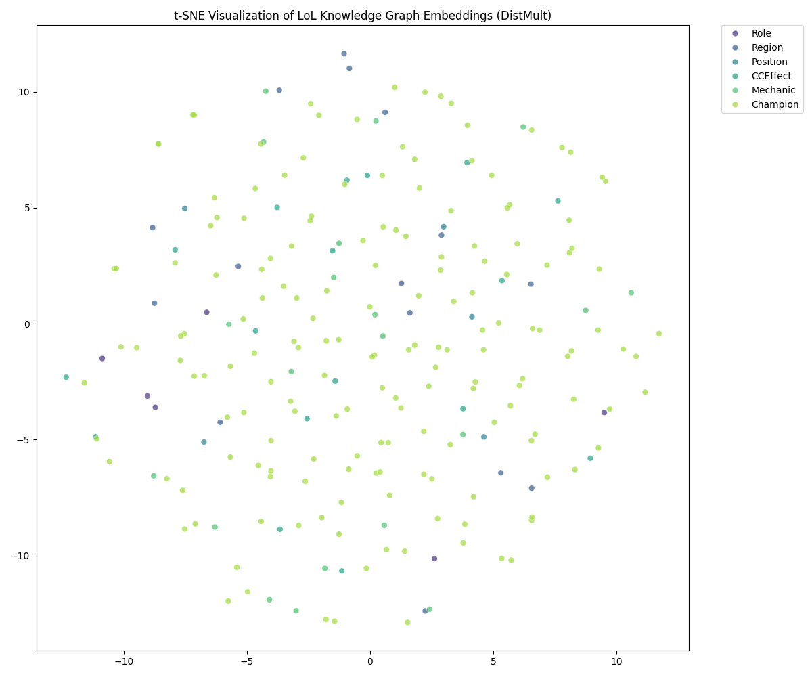

# LoL Knowledge Graph

An end-to-end semantic knowledge graph built on the *League of Legends* universe. The pipeline covers data crawling, RDF ontology construction, Wikidata alignment, OWL/SWRL reasoning, Knowledge Graph Embeddings, and a Retrieval-Augmented Generation (RAG) interface — exposed through a Next.js web app backed by a FastAPI server.

---

## Table of Contents

1. [Project Overview](#project-overview)
2. [Architecture](#architecture)
3. [Prerequisites](#prerequisites)
4. [Installation](#installation)
5. [Environment Variables](#environment-variables)
6. [Running Each Module](#running-each-module)
   - [Step 1 — Web Crawling](#step-1--web-crawling)
   - [Step 2 — KB Construction & Alignment](#step-2--kb-construction--alignment)
   - [Step 3 — KB Expansion](#step-3--kb-expansion)
   - [Step 4 — Finalise the KB](#step-4--finalise-the-kb)
   - [Step 5 — Reasoning (SWRL)](#step-5--reasoning-swrl)
   - [Step 6 — KGE Preparation](#step-6--kge-preparation)
   - [Step 7 — KGE Training & Evaluation](#step-7--kge-training--evaluation)
   - [Step 8 — KGE Analysis & t-SNE](#step-8--kge-analysis--t-sne)
7. [Running the RAG Demo](#running-the-rag-demo)
   - [CLI Mode (Ollama)](#cli-mode-ollama)
   - [CLI Mode (Groq / master chat)](#cli-mode-groq--master-chat)
   - [Web Interface](#web-interface)
8. [Hardware Requirements](#hardware-requirements)
9. [Repository Structure](#repository-structure)
10. [KB Statistics](#kb-statistics)
11. [Screenshots](#screenshots)
12. [Troubleshooting](#troubleshooting)

---

## Project Overview

| Component | Description |
|-----------|-------------|
| **Data sources** | LoL Wiki (MediaWiki API) + Riot Data Dragon CDN |
| **Champions** | 172 playable champions (patch V14.20) |
| **Ontology** | RDF/OWL in Turtle format — 10 classes, 50+ properties |
| **KB size** | 52,054 triples · 14,594 entities · 196 relations |
| **Alignment** | `owl:sameAs` links to Wikidata (confidence ≥ 0.70) |
| **Expansion** | 2-hop SPARQL expansion from Wikidata |
| **Reasoning** | SWRL rules via OWLReady2/Pellet, OWL reasoning via HermiT |
| **KGE models** | TransE, DistMult (PyKEEN) — DistMult MRR: **0.441** |
| **RAG** | NL→SPARQL with auto self-repair (Ollama or Groq) |
| **Web UI** | Next.js 16 + FastAPI backend |

---

## Architecture

```
wiki.leagueoflegends.com          ddragon.leagueoflegends.com
        │                                    │
  wiki_api.py                           ddragon.py
        │                                    │
  data/raw/wiki_raw.json         data/raw/ddragon_raw.json
        └──────────────┬──────────────────────┘
                    merge.py + nlp_extractor.py
                            │
               data/processed/enriched.json
                            │
                    lol_ontology_v3.ttl          ← private KB (35k triples)
                            │
             pipeline/alignement/
          align_wikidata.py → alignment_mapping.csv
          align_predicates.py → predicate_alignment.ttl
                            │
             pipeline/expansion/
          expand_kb.py → expanded_kb.nt          (1-hop Wikidata)
          expand_kb_2hop.py → expanded_kb_2hop.nt (2-hop Wikidata)
                            │
                   finalize_kb.py
                            │
               data/processed/final_kb.nt        ← 52k triples
                            │
         ┌──────────────────┴──────────────────┐
         │                                     │
      swrl.py                    pipeline/embeddings/
   (Pellet reasoning)          kge_prepare.py → train/valid/test
   final_kb_reasoned.owl       kge_train.py   → models/kge/
                               kge_analysis.py → results/plots/
                                     │
                            rag-lab/
                     lab_rag_sparql_gen.py  (CLI, Ollama)
                     master_chat.py         (CLI, Groq/Ollama)
                            │
                    api.py (FastAPI)
                            │
                    website/  (Next.js)
```

---

## Prerequisites

Make sure the following are installed before proceeding.

### Python
- **Python 3.10 or 3.11** (Python 3.12 works but some OWLReady2 features may warn)
- `pip` or `conda`

### Node.js (for the web interface only)
- **Node.js 18+** and **npm 9+**  
  Check: `node --version` and `npm --version`

### Ollama (for local RAG)
- Download and install from [https://ollama.com](https://ollama.com)
- After install, pull the default model:
  ```bash
  ollama pull llama3.1:8b
  ```
- Keep it running in the background:
  ```bash
  ollama serve
  ```

### Java (for SWRL reasoning in Protégé — optional)
- Java 11+ is required if you want to run HermiT inside **Protégé**
- OWLReady2/Pellet does **not** require Java

---

## Installation

### 1. Clone the repository

```bash
git clone https://github.com/Mascode-Dev/lol-graph.git
cd lol-graph
```

### 2. Create and activate a virtual environment

```bash
# Using venv
python -m venv venv
source venv/bin/activate        # Linux / macOS
venv\Scripts\activate           # Windows
```

### 3. Install Python dependencies

```bash
pip install -r requirements.txt
```

> **Note:** The `requirements.txt` pins exact versions and includes `torch==2.11.0+cu126` (CUDA 12.6). If you are on CPU only or a different CUDA version, install PyTorch manually first:
> ```bash
> # CPU only
> pip install torch torchvision --index-url https://download.pytorch.org/whl/cpu
> # Then install the rest
> pip install -r requirements.txt --ignore-requires-python
> ```

### 4. Download the spaCy language model

```bash
python -m spacy download en_core_web_sm
```

### 5. Install Node.js dependencies (web interface only)

```bash
cd website
npm install
cd ..
```

---

## Environment Variables

Create a `.env` file at the root of the project:

```bash
cp .env.example .env   # if the example exists, otherwise create it manually
```

Then fill in the required values:

```env
# --- Groq API (required for the web interface and master_chat.py in groq mode) ---
GROQ_API_KEY=your_groq_api_key_here
GROQ_MODEL=llama3-8b-8192          # or any model available on your Groq plan

# --- Optional: VPS IP for remote deployment ---
VPS_IP=your.server.ip.address
```

> **Where to get a Groq API key:** Sign up for free at [https://console.groq.com](https://console.groq.com). The free tier is sufficient for running the demo.

> **Ollama users:** No API key is needed. Ollama runs entirely locally. Make sure `ollama serve` is running before launching the CLI.

---

## Running Each Module

All commands below are run from the **root of the repository** with your virtual environment activated, unless stated otherwise.

---

### Step 1 — Web Crawling

This step fetches all champion data from the two official sources and produces the raw JSON files used by the rest of the pipeline.

#### Option A — Full pipeline (recommended, ~6 min)

```bash
# Fetch from the LoL Wiki (HTML + Lua module — richest data)
python pipeline/web-crawling/wiki_api.py --output data/raw/wiki_raw.json

# Fetch from Riot Data Dragon (parallel, ~2 min)
python pipeline/web-crawling/ddragon.py --output data/raw/ddragon_raw.json --stats

# Merge both sources + run NLP extraction → produce enriched.json + TTL ontology
python pipeline/web-crawling/merge.py \
  --wiki data/raw/wiki_raw.json \
  --dd   data/raw/ddragon_raw.json \
  --enriched data/processed/enriched.json \
  --ttl  lol_ontology_v3.ttl
```

#### Option B — Quick test on 5 champions (~30 sec)

```bash
python pipeline/web-crawling/wiki_api.py --limit 5 --output data/raw/wiki_test.json
python pipeline/web-crawling/ddragon.py  --limit 5 --output data/raw/dd_test.json
python pipeline/web-crawling/merge.py \
  --wiki data/raw/wiki_test.json \
  --dd   data/raw/dd_test.json \
  --enriched data/processed/test_enriched.json \
  --ttl  test.ttl
```

#### Option C — Resume after interruption

```bash
python pipeline/web-crawling/wiki_api.py \
  --resume data/raw/wiki_raw.json \
  --output data/raw/wiki_raw.json
```

**Outputs:** `data/raw/wiki_raw.json`, `data/raw/ddragon_raw.json`, `data/processed/enriched.json`, `lol_ontology_v3.ttl`

---

### Step 2 — KB Construction & Alignment

This step links your private champion entities to Wikidata using SPARQL and the Wikidata Search API, then aligns predicates.

```bash
# Stage 1: Entity alignment → produces alignment_mapping.csv
python pipeline/alignement/align_wikidata.py

# Stage 2: Predicate alignment + filter by confidence ≥ 0.70
python pipeline/alignement/align_predicates.py
```

**Outputs:** `data/processed/alignment_mapping.csv`, `data/processed/alignment.ttl`, `data/processed/predicate_alignment.ttl`

---

### Step 3 — KB Expansion

Expand the private KB with Wikidata triples via SPARQL (requires internet access).

```bash
# 1-hop expansion: fetch Wikidata triples for each aligned champion
python pipeline/expansion/expand_kb.py

# 2-hop expansion: fetch triples for entities discovered in hop 1 (takes ~10-20 min)
python pipeline/expansion/expand_kb_2hop.py
```

> **Note:** Both scripts respect Wikidata's rate limits with built-in back-off. Do not reduce the sleep timers.

**Outputs:** `data/processed/expanded_kb.nt`, `data/processed/expanded_kb_2hop.nt`

---

### Step 4 — Finalise the KB

Merge the private ontology with the expanded Wikidata triples into a single N-Triples file.

```bash
python pipeline/finalize_kb.py
```

**Output:** `data/processed/final_kb.nt` (~52k triples)

---

### Step 5 — Reasoning (SWRL)

Applies a SWRL rule using OWLReady2 + the Pellet reasoner to infer the `Engager` playstyle tag for champions that have both a Dash mechanic and a Stun CC effect.

```bash
python swrl.py
```

> **What this does:**
> - Converts `lol_ontology_v3.ttl` → `lol_ontology_v3.owl` (RDF/XML) for OWLReady2 compatibility  
> - Fires the SWRL rule over all Champion instances  
> - Saves the enriched ontology to `data/processed/final_kb_reasoned.owl`
> - Prints every champion that received the `Engager` tag

> **Protégé alternative:** Open `lol_ontology_v3.ttl` in Protégé → Reasoner → HermiT 1.4 → Start Reasoner to test OWL inference (symmetric `isAllyOf`/`isEnemyOf`) without Python.

---

### Step 6 — KGE Preparation

Parses `final_kb.nt`, extracts entity-to-entity triples only (literals are discarded), deduplicates, and produces the 80/10/10 train/valid/test split.

```bash
python pipeline/embeddings/kge_prepare.py
```

**Outputs:** `data/kge/train.txt` (22,220 triples), `data/kge/valid.txt` (1,501), `data/kge/test.txt` (1,528)

---

### Step 7 — KGE Training & Evaluation

Trains TransE and DistMult using PyKEEN with embedding dimension 100 for 200 epochs. Uses GPU automatically if CUDA is available.

```bash
python pipeline/embeddings/kge_train.py
```

Expected training time:
- GPU (CUDA): ~5–10 min per model
- CPU only: ~30–60 min per model

**Outputs:**
- `models/kge/TransE/` and `models/kge/DistMult/` — saved PyKEEN model directories
- `results/kge/comparison_results.csv` — MRR, Hits@1/3/10 for both models

| Model | MRR | Hits@1 | Hits@3 | Hits@10 |
|-------|-----|--------|--------|---------|
| TransE | 0.139 | 0.042 | 0.194 | 0.310 |
| **DistMult** | **0.441** | **0.328** | **0.525** | **0.599** |

---

### Step 8 — KGE Analysis & t-SNE

Loads the trained DistMult model, finds nearest neighbours for sample champions, and produces a t-SNE visualisation coloured by entity class.

```bash
python pipeline/embeddings/kge_analysis.py
```

**Output:** `results/plots/kge_tsne.png`

---

## Running the RAG Demo

### CLI Mode (Ollama)

Make sure `ollama serve` is running and `llama3.1:8b` is pulled, then:

```bash
python rag-lab/master_chat.py
```

This launches an interactive prompt. For each question, the system shows:
1. The baseline LLM answer (no KG)
2. The generated SPARQL query
3. Whether the query was auto-repaired
4. The query results from the local RDF graph

**Example questions to try:**
```
Which champions are from Noxus?
Which Top laners have a Knock_Up and a Dash?
What is Ahri's base HP?
Which champions have both Execute and Hard_CC tags?
Which champions have mobility rating 3?
```

---

### CLI Mode (Groq / master chat)

The master chat combines SPARQL retrieval with KGE-based link completion. Requires a valid `GROQ_API_KEY` in `.env`.

```bash
python rag-lab/master_chat.py
```

This loads `data/processed/final_kb.nt` and the trained DistMult model. For structured queries it uses SPARQL; for similarity/recommendation queries it falls back to KGE predictions via `predict_target()`.

---

### Web Interface

The web interface requires **both** the FastAPI backend and the Next.js frontend to be running simultaneously.

#### Terminal 1 — Start the FastAPI backend

```bash
# From the project root, with venv activated
uvicorn api:app --host 0.0.0.0 --port 8000 --reload
```

The API will be available at `http://localhost:8000`. You can explore the auto-generated docs at `http://localhost:8000/docs`.

Available endpoints:
- `POST /api/chat` — sends a natural language question, returns an answer + SPARQL query used
- `GET /api/champions` — returns the full champion list from `data/processed/enriched.json`

#### Terminal 2 — Start the Next.js frontend

```bash
cd website
npm run dev
```

Open [http://localhost:3000](http://localhost:3000) in your browser.

| Page | URL | Description |
|------|-----|-------------|
| Home | `/` | Project landing page |
| Chat | `/chat` | Natural language Q&A backed by RAG |
| Explore | `/explore` | Browse champion data |
| About | `/about` | Project description |

> **Note:** The chat page calls the FastAPI backend at `http://localhost:8000`. If you change the port, update the fetch URL in `website/src/app/chat/page.tsx`.

---

## Hardware Requirements

| Task | Minimum | Recommended |
|------|---------|-------------|
| Web crawling | Any machine with internet | Any |
| Wikidata expansion | 4 GB RAM | 8 GB RAM |
| KB loading (rdflib) | 4 GB RAM | 8 GB RAM |
| SWRL reasoning (Pellet) | 4 GB RAM | 8 GB RAM |
| KGE training (CPU) | 8 GB RAM | 16 GB RAM |
| KGE training (GPU) | NVIDIA GPU, 4 GB VRAM | 8+ GB VRAM |
| RAG CLI (Ollama, llama3.1:8b) | 8 GB RAM (CPU) | 8 GB VRAM (GPU) |
| Web interface | Any | Any |

> The project was originally trained with `torch==2.11.0+cu126` (CUDA 12.6). CPU fallback is automatic — PyKEEN and the `api.py` server both detect the device at runtime.

---

## Repository Structure

```
lol-graph/
├── pipeline/
│   ├── web-crawling/
│   │   ├── wiki_api.py          # LoL Wiki MediaWiki API crawler
│   │   ├── ddragon.py           # Riot Data Dragon CDN fetcher
│   │   ├── merge.py             # Merge + TTL generation
│   │   ├── nlp_extractor.py     # CC effects, mechanics, playstyle NLP
│   │   ├── fetch_regions.py     # Runeterra region fetcher
│   │   └── patch_roles.py       # Role patching utility
│   ├── alignement/
│   │   ├── align_wikidata.py    # Entity alignment to Wikidata
│   │   └── align_predicates.py  # Predicate alignment + TTL export
│   ├── expansion/
│   │   ├── expand_kb.py         # 1-hop Wikidata SPARQL expansion
│   │   └── expand_kb_2hop.py    # 2-hop expansion
│   ├── embeddings/
│   │   ├── kge_prepare.py       # Parse NT → train/valid/test split
│   │   ├── kge_train.py         # TransE + DistMult training (PyKEEN)
│   │   └── kge_analysis.py      # Nearest neighbours + t-SNE plot
│   └── finalize_kb.py           # Merge private KB + expanded NT
│
├── rag-lab/
│   ├── lab_rag_sparql_gen.py    # NL→SPARQL RAG CLI (Ollama)
│   ├── lab_rag_kge_predict.py   # KGE prediction helper
│   └── master_chat.py           # Combined RAG + KGE CLI (Groq/Ollama)
│
├── website/                     # Next.js 16 web interface
│   ├── src/app/
│   │   ├── page.tsx             # Landing page
│   │   ├── chat/page.tsx        # Chat interface
│   │   ├── explore/page.tsx     # Champion explorer
│   │   └── about/page.tsx       # About page
│   └── package.json
│
├── data/
│   ├── raw/                     # wiki_raw.json, ddragon_raw.json
│   ├── processed/               # enriched.json, final_kb.nt, alignment files
│   └── kge/                     # train.txt, valid.txt, test.txt
│
├── models/
│   └── kge/
│       ├── TransE/              # Saved TransE model
│       └── DistMult/            # Saved DistMult model
│
├── results/
│   ├── kge/comparison_results.csv
│   └── plots/kge_tsne.png
│
├── lol_ontology_v3.ttl          # Main ontology (Turtle)
├── lol_ontology_v3.owl          # OWL/RDF-XML version (auto-generated by swrl.py)
├── swrl.py                      # SWRL reasoning script
├── api.py                       # FastAPI backend
├── requirements.txt             # Python dependencies
├── all_relations.txt            # Full list of KG relations with counts
└── .env                         # Your local environment variables (not committed)
```

---

## KB Statistics

| Metric | Value |
|--------|-------|
| Total RDF triples | 52,054 |
| Total entities | 14,594 |
| Distinct relation types | 196 |
| Anchor champion entities | 170 |
| Base KB (private only) | 35,109 triples |
| Expansion method | 2-hop SPARQL from Wikidata |
| Alignment confidence threshold | ≥ 0.70 |
| Export format | N-Triples (`.nt`) |
| Average degree | ~2.01 triples/entity |

---

## Screenshots

### t-SNE Embedding Visualisation



*Entity embeddings from the trained DistMult model, reduced to 2D with t-SNE and coloured by ontological class (Champion, Spell, Skin, Region, CCEffect, etc.).*

---

## Troubleshooting

**`torch` installation fails or CUDA version mismatch**  
Install the CPU-only version first, then the rest of the requirements:
```bash
pip install torch torchvision --index-url https://download.pytorch.org/whl/cpu
pip install pykeen rdflib owlready2 fastapi uvicorn groq python-dotenv requests spacy pandas scikit-learn matplotlib seaborn
```

**`owlready2` Pellet reasoner not found**  
OWLReady2 ships with Pellet internally — no separate install needed. If it fails, check that Java is not interfering and that `owlready2==0.50` is installed.

**Ollama connection refused**  
Make sure the Ollama server is running: `ollama serve`. If it's already running on a different port, update `OLLAMA_URL` in `rag-lab/lab_rag_sparql_gen.py`.

**Wikidata expansion rate-limited (HTTP 429)**  
The scripts handle this automatically with exponential back-off. If you keep hitting 429, add `time.sleep(30)` manually and re-run. The 1-hop and 2-hop scripts can be restarted — they will skip already-expanded entities.

**`data/processed/final_kb.nt` not found when starting the API**  
You need to run the full pipeline (Steps 1–4) at least once before starting the web interface. Alternatively, if you only need the chat feature on the private KB, edit `KG_PATH` in `rag-lab/master_chat.py` to point to `lol_ontology_v3.ttl` instead.

**Next.js build error: `lucide-react` version mismatch**  
```bash
cd website && npm install lucide-react@latest
```
